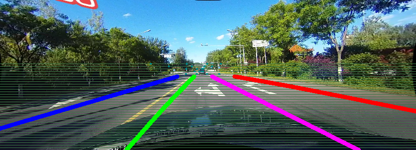

### This code is for processing annotations of [CULane](https://xingangpan.github.io/projects/CULane.html) dataset



It could:  
(a) generate per-pixel labels from original annotation files.  
(b) generate list files for training.  

### Preparation
1. Suppose that you have downloaded the [CULane dataset](https://xingangpan.github.io/projects/CULane.html) as described in [SCNN](https://github.com/XingangPan/SCNN).  

Note: If you have downloaded the dataset before 16th April 2018, please update the raw annotations for train&val set as described in the dataset website.

2. Clone and make
    ```Shell
    git clone https://github.com/XingangPan/seg_label_generate.git
    cd seg_label_generate
    make
    ```

### Run the code
1. To visualize annotations, simply modify the CULane path of labelGen.sh to yours and run this script.  

2. To generate per-pixel labels, remove the '-s' in labelGen.sh and run it.  

3. To generate list files with indication of the existance of lane markings (like the train\_gt.txt provided in the dataset), run listGen.sh.
Also remember to modify the CULane path to yours.
